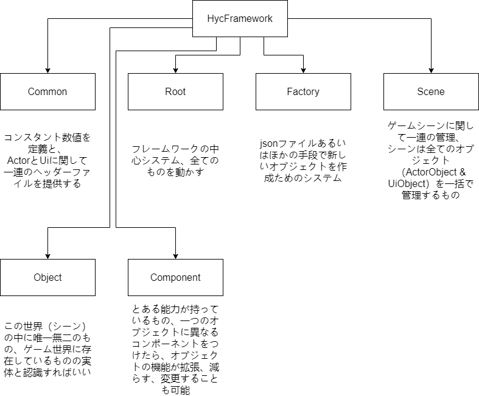
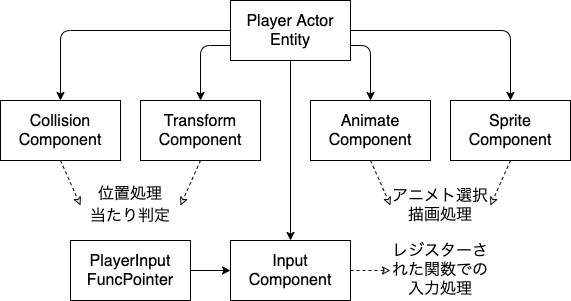
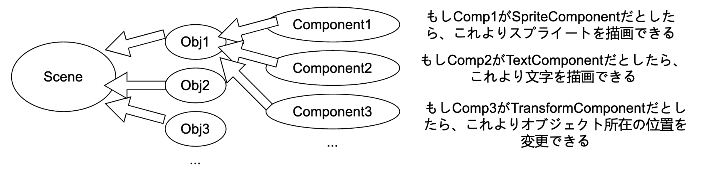
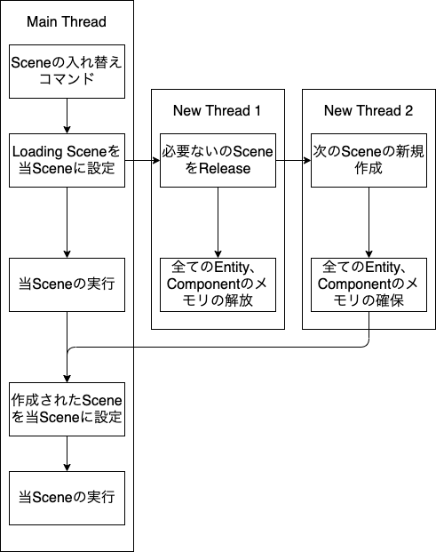
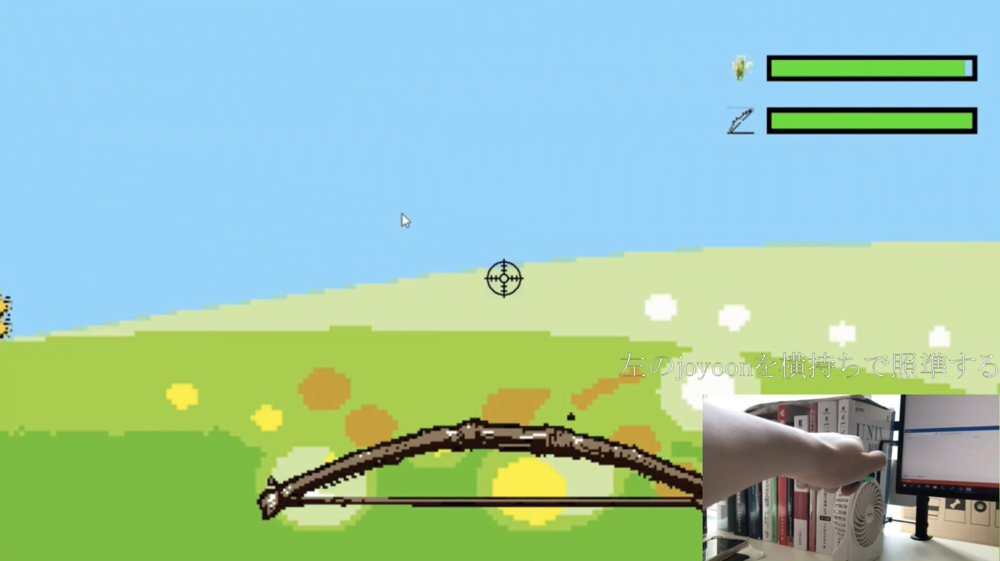
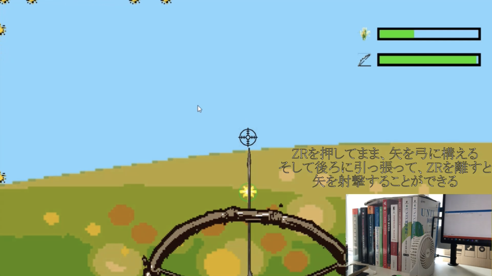
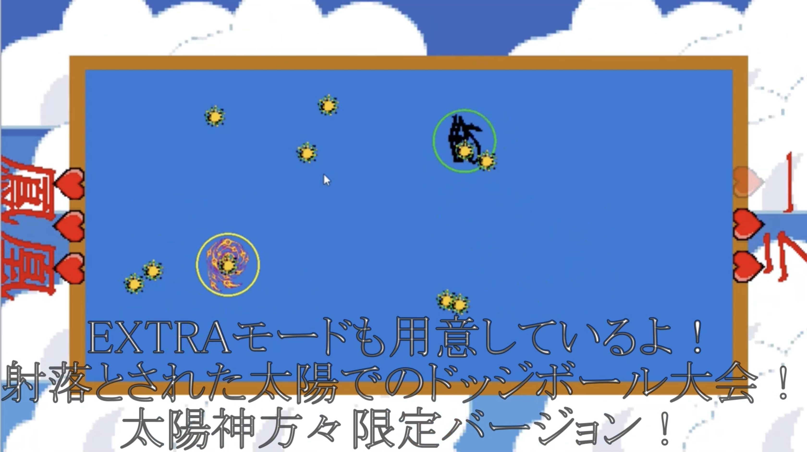

## HycFrame2Dについて

>HycFrame2DはWindowsをプラットフォームにして、汎用性が持っている通用2Dゲーム開発できるのフレームワークを目指して作った物であります。

[ソースコード](https://github.com/HIBICUS-CAI/HycFrame2D)

フレームワークの特徴 :

- Entity+Componentの組み方
- シーンの内容物をJSON化してデータとして保存
- スクリプトに似てる特定コードの実行方

## フレームがサポートしている内容

主に四つの部分に分けられています :

- 特定の処理をレジスター・実行するできるInteractionとInput仕組み
- Interaction・Input以外用意している多様なコンポーネント
- SceneNodeに関する管理・操作機能
- 音声・JSON解析等のサブシステム

コンポーネントについての情報 :

|             Component種類             |                                                                                                                 提供している機能                                                                                                                  |
| :-----------------------------------: | :-----------------------------------------------------------------------------------------------------------------------------------------------------------------------------------------------------------------------------------------------: |
| (Actor&UI)<br>[A/U]TransformComponent |                                                                                                          Objectの位置、角度と大きさ調整                                                                                                           |
|   (Actor&UI)<br>[A/U]InputComponent   |                                                                レジスターされていた入力関数を入力処理段階で自動的に呼び出す<br>Unity C# Scriptのようなカスタマイズできる処理仕組み                                                                |
| (Actor&UI)<br>[A/U]InteractComponent  | レジスターされていた初期化関数を初期化段階で自動的に呼び出す<br>レジスターされていた更新用関数を更新段階で自動的に呼び出す<br>レジスターされていたリリース関数を削除する時自動的に呼び出す<br>Unity C# Scriptのようなカスタマイズできる処理仕組み |
|  (Actor&UI)<br>[A/U]SpriteComponent   |                                                                                                       テクスチャの描画処理<br>Offset色処理                                                                                                        |
|   (Actor)<br>[A]CollisionComponent    |                                                                                        二つのものは当たっているかどうかを判断<br>円と四角形処理のサポート                                                                                         |
|    (Actor)<br>[A]AnimateComponent     |                                                                             複数のスプライトアニメーションを読み込み<br>特定のアニメーションに変わる<br>再生速度調整                                                                              |
|     (Actor)<br>[A]TimerComponent      |                                                                        複数のタイマーを作る<br>特定タイマーの開始、一時停止、リセット処理<br>ある時間に越えたどうかの判断                                                                         |
|      (UI)<br>[U]BtnMapComponent       |                                                                                       隣のボタンを選択する機能<br>このボタンは選択されているかどうかの判断                                                                                        |
|       (UI)<br>[U]TextComponent        |                                                                               キャラクタ配列より自動的に文字を描画する仕組み<br>標準フォマードサポート（\n・\t等）                                                                                |

## コードの組み方

フレームワークの大体なアーキテクチャーは下のように幾つの部分に分けられています。

- 絶対必要なベースツール
- フレームワーク担当機能より利用している中間ツール・ファイル
- HycFrame3Dフレームワーク自体
- フレームワークに紐つけているファイル

各部分について詳しい説明をします。

**ベースツール**

- 描画処理システム
- ログを標準フォーマットで出力するプリンター（実行上の不具合やデバッグメッセージを出力欄にプリントアウト用）

**中間ツール・ファイル**

- JSONファイル読み込み・解析できるツール関数（シーンファイル解析やコンフィギュレーションファイル解析などのところに利用しています）
- 音声ファイルの読み込み・再生関連ツール関数
- テクスチャファイルを読み込み関連ツール関数

**フレームワーク自体**

- Rootシステム（フレームワーク実体の起動・リリース・実行を管理する部分）
- Sceneシステム（シーンの切替え・リリース・当シーンの参照とかの機能を提供している部分）
- Factoryシステム（JSONファイルより新規シーンあるいは新規オブジェクトを生成する部分）

**紐つけるファイル**

- 特定のSystemとComponentより呼び出す、特定なコード実行するの部分、関数ポインタでフレームワークにレジスター・紐付けています

全体は主に図のように組み立てています :



## 特に頑張ったところ

- コンポーネントベースシステム & スクリプトに似てる感じのコード実行

    最初はEntity-Component-Systemの文章を読み、Unityのコンポーネントと結構似ていると気付きました。従って、このようなコンポーネントベースの組み方を利用して、フレームワークを作るという発想を思いつきました。

    一つのEntityに異なる機能を持っているComponentを添付するより、実行の時必要な挙動をさせることができ、加えて必要性より随時追加・削除もできます。継承よりの機能実装と比べると、再利用可能、管理しやすい、データをファイルに保存しやすい等の優位性を持っています。

    しかしこの時の私は、まだSystemがどんな役をしているかを分からないので、それを抜いてEntityとComponentのみでフレームワークを組み立てました。

    
    
    

    それと強いて言えば、これはECSではなく、Unityの方とより近いと思います。もし完全にECSのやり方ですれば、ゲームシステムに関しての処理が複雑になり、ファイルに保存すると不確定要素が多くになるでしょう。従って私のやり方は、よく使われる機能（当たり判定、Transform処理等）をコンポーネントにし、ゲームシステムに関しての処理をフレームワークにレジスターされた関数ポインタ経由で行うと決めました。

    でもこれは悪い点ではないと思います。このやり方より、全てのゲームシステムに関しての処理をInteract・Inputコンポーネントに集中でき、矛盾がない限り全ての関数ポインタも再利用できるようにしました。例えば
    ```
    Interact処理A = 関数1 + 関数2
    Input処理B = 関数2 + 関数4 + 関数1
    ```
    これで矛盾がないなら、関数1、2が再利用できます。もし再利用性を求めて、各関数をコンポーネント化したら、コンポーネントの数が増えてしまうし、管理や実行の負荷が重くなるかもしれません。もし処理量を減るため処理ごとをコンポーネント化したら、たとえ一部の処理が同じでも、それをもう一回書かないいけないになると考えています。

- JSONシーンファイルよりのデータ管理

    このやり方を思いついたきっかけは、手で全てのものをコードに書き込む時の苦労でした。そしてコンポーネントベースのフレームワークに対して、JSONファイルにするとただ各コンポーネントを初期化する時必要なデータを保存すればいいです。

    最初はXMLとJSONの間に迷ったが、最後はJSONがそのまま編集しやすいのでJSONを選びました。これでシーンを編集する時、いちいちコードを編集やコードの再コンパイルが要らず、JSONファイルを保存するだけで済ませました。

    ```json
    {
      "scene-name": "first-scene",
      "camera": [ 0.0, 0.0, 1920.0, 1080.0 ],
      "actor": [
        {
          "actor-name": "test",
          "update-order": 0,
          "parent": null,
          "components": [
            {
              "type": "transform",
              "update-order": -1,
              "init-value": [ 0.0, 0.0, 0.0 ],
              "position": [ null, null, null ],
              "rotation": [ null, null, null ],
              "scale": [ 1.5, 1.5, 1.5 ]
            },
            {
              "type": "sprite",
              "update-order": 0,
              "draw-order": 0,
              "texture-path": "rom:/Assets/Texturestexture.tga",
              "texture-width": 200.0,
              "texture-height": 200.0
            },
            {
              "type": "collision",
              "update-order": 0,
              "collision-type": "circle",
              "collision-size": [ 100.0, 100.0 ],
              "show-flag": true
            },
            {
              "type": "animate",
              "update-order": 0,
              "animates": [
                {
                  "animate-name": "number",
                  "animate-path": "rom:/AssetTextures/number.tga",
                  "animate-stride": [ 0.2, 0.2 ],
                  "max-count": 13,
                  "repeat-flag": false,
                  "frame-time": 1.0
                }
              ],
              "init-animate": "number"
            },
            {
              "type": "interaction",
              "update-order": 0,
              "init-func-name": "TestInit",
              "update-func-name": "TestUpdate",
              "destory-func-name": "TestDestory"
            }
          ]
        }
      ],
      "ui": [
        {
          "ui-name": "test-ui2",
          "update-order": 0,
          "parent": null,
          "components": [
            {
              "type": "text",
              "update-order": 0,
              "moji-path": "rom:/Assets/Textures/moji.tga",
              "init-text": "it's a great day, \nあいうえお \nきょうはいいてんきて゛すね \nやゆよンは゛° nice \n 0321054.34654",
              "init-size": [ 30.0, 30.0 ],
              "init-position": [ -940.0, -520.0, 0.0 ],
              "init-color": [ 0.0, 0.0, 0.0, ]
            }
          ]
        }
      ]
    }
    ```

    それと、JSON化したもう一つの利点は、もし将来こういうシーン編集処理をGUI化する必要があったら、従来難しい操作をJSONファイルの操作に変換することで、手間を取らずに実装できると考えています。

- マルチスレッドでのシーン管理

    最初はスイッチの性能より低いロード速度を向上するため、シーンの切り替えをマルチスレッド化にすることになってきました。

    この処理を通じて、最初の14秒ぐらいかかったシーンのローディングは5秒ぐらいに短縮しました。

    

    でもその後私は、Entity-Componentと組合せば、どれぐらいのEntityが作れたを確認できることを気づいました。つまりローディングの進み具合も画面に表示できるようになりました。なお、これでダイナックなローディング画面作成も可能になり、より面白いゲームを作れると思います。

## フレームを実行するため必要なもの（整合済）

- [03_InputDevice](https://github.com/HIBICUS-CAI/PreWorkRenderEngine) 自分で作った入力処理ライブラリー
- [04_WindowManager](https://github.com/HIBICUS-CAI/PreWorkRenderEngine) 自分で作ったWIN32アプリ管理ライブラリー
- [texconv](https://github.com/microsoft/DirectXTex) イメージファイルをPNG・TGAファイルに変換するツール
- [rapidjson](https://github.com/Tencent/rapidjson) JSONファイル解析ライブラリー
- [GLFW3](https://www.glfw.org/) （OpenGLバージョンのみ）ウィンドウ制御ライブラリー

## 改善点

まとめた改善点は以下の通り :

- HycFrame3Dに解決済
  - 描画システムの不足

    このフレームワークの描画システムはただテクスチャをそのままでスクリーンに描画するだけ、OffsetColorがサポートしていてもシンプルすぎて、複雑な効果が作れないでしょう。

    この不足を補完するため、[HycFrame3D](hycframe3d_jp.md)に実装された[レンダリングシステムライブラリー](rendersystem_jp.md)を開発し、ある程度で現段階の最適解を実用化しました。

  - `new`でのメモリ確保よりの低い速度

    このフレームワークのEntityとComponentは全部`new`で直接確保されています。処理は簡単ですが、CPUキャッシュをうまく利用できず、実行速度が減られると考えています。

    [HycFrame3D](hycframe3d_jp.md)は同種類のComponentを一つの`vector`にまとめて、連続のデータ構造でCPUキャッシュ利用率を上げることができます。

- まだ残っている問題点
  - 無駄の描画処理

    画面外のテクスチャはスクリーンに描画される可能性全くないですが、こういう無駄な描画のコマンドが相変わらず提出されて、実行速度を蚕食しています。

    従って、こういう無駄なDrawCallを事前に検出し、素早く捨てべきです。

## これで作っていた作品

>大羿射日、古中国の伝説の英雄神話をゲーム化した作品。
>
>太古の時、天に十個の太陽があり、その熱さのせいで民が苦しんでいた。プレーヤーは英雄「羿」になり、Joyconを使って天から狂っている太陽を射落として、皆を救うというゲームです。
>
>さらに、射落された太陽を使って、太陽神たちのドッジボール大会というミニゲームも友達と楽しめます。

詳しくはこの[ページ](sun_shoot_jp.md)ご覧ください。

PV↓

<iframe width="100%" height="500" src="https://www.youtube.com/embed/prv0hxfCRGs" title="YouTube video player" frameborder="0" allow="accelerometer; autoplay; clipboard-write; encrypted-media; gyroscope; picture-in-picture" allowfullscreen></iframe>

ゲーム画面↓




