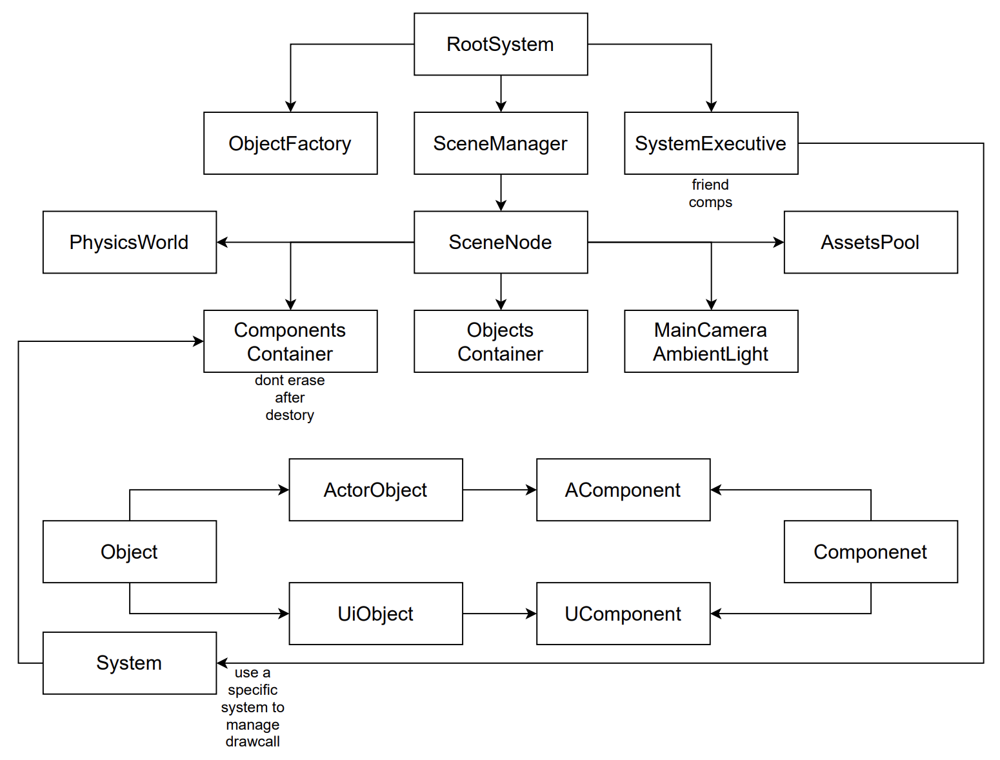

## HycFrame3Dについて
>HycFrame3DはWindowsをプラットフォームにして、汎用性が持っている通用3Dゲーム開発できるのフレームワークを目指して作った物であります。

- Entity-Component-Systemという考え方よりのソフトウェアアーキテクチャ
- 自由に構築可能な描画システム
- 柔軟性を持っているシーン設計
- 最も基本な機能を備えている

### 前身
このフレームワークの前身は大体半年前作っていた2Dゲーム開発ようのものです（今はHycFrame2Dという名をつけました）。

HycFrame2Dは様々の問題点があったり、座標系の仕様もなかなか変なので、3Dゲーム開発としては足りない部分あまりにも多くて、新しいフレームワークを作るという話になってきました。

最初目指した改善点お主に以下のもの：
- 汎用性が持っている座標系
- CPUキャッシュにより効率いい組み方
- もっと柔軟な描画パイプライン
- 3Dに必要なコンポーネントを導入

### コードの組み方
フレームワークの大体なアーキテクチャーは下のように幾つの部分に分けられています。

- 絶対必要なベースツール
- フレームワーク担当機能より利用している中間ツール・ファイル
- HycFrame3Dフレームワーク自体
- フレームワークに紐つけているファイル

各部分について詳しい説明をします。

**ベースツール**

- 短いても経過時間を測れるタイマー（deltatime計算用）
- ログを標準フォーマットで出力するプリンター（実行上の不具合やデバッグメッセージを出力欄にプリントアウト用）

**中間ツール・ファイル**

- JSONファイルを読み込み・解析できるツール関数（シーンファイル解析やコンフィギュレーションファイル解析などのところに利用しています）
- モデルファイルを読み込み、フレームワークが解析できるデータに変換するツール関数
- 音声ファイルを読み込みためのツール関数

**フレームワーク自体**

- Rootシステム（フレームワーク実体の起動・リリース・実行を管理する部分）
- Sceneシステム（シーンの切替え・リリース・当シーンの参照とかの機能を提供している部分）
- Factoryシステム（JSONファイルより新規シーンあるいは新規オブジェクトを生成する部分）
- Systemシステム（名前がちょっと怪しいが、これはECSの「S」の意味、全てのSystemを管理・駆動する部分）

**紐つけるファイル**

- 特定のSystemとComponentより呼び出す、特定なコード実行するの部分、関数ポインタでフレームワークにレジスター・紐付けています

フレームワークのソフトウェアアーキテクチャーについて、お主に次の図のように組み立ています。

### フレームを実行するため必要なもの（整合済）

### フレームがサポートしている内容

### 改善点

### これで作っていた作品