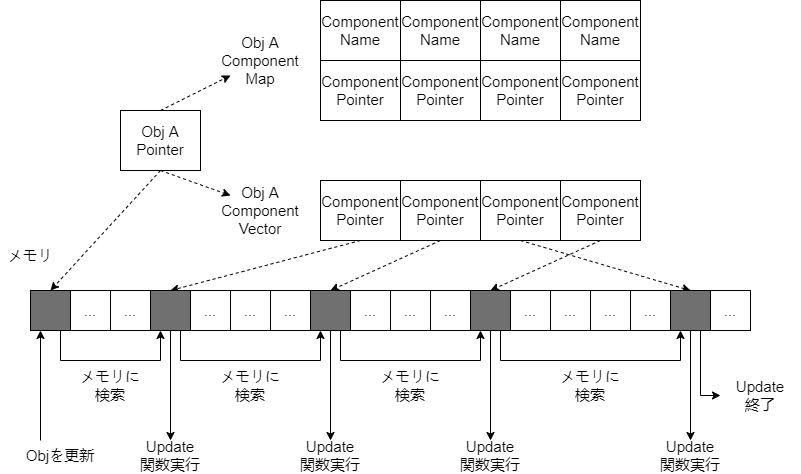
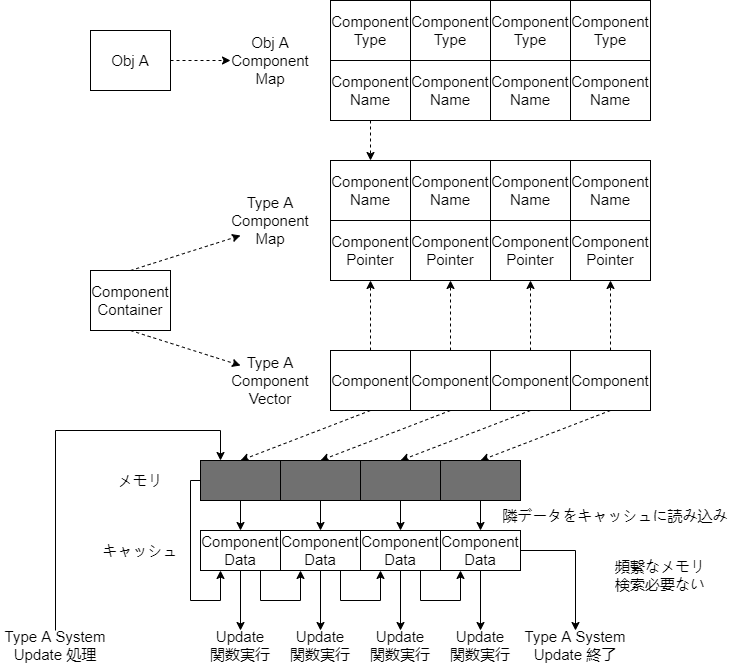

## HycFrame3Dについて
>HycFrame3DはWindowsをプラットフォームにして、汎用性が持っている通用3Dゲーム開発できるのフレームワークを目指して作った物であります。

- Entity-Component-Systemという考え方よりのソフトウェアアーキテクチャ
- 自由に構築可能な描画システム
- 柔軟性を持っているシーン設計
- 備えたよく使われる機能

### 前身
このフレームワークの前身は大体半年前作っていた2Dゲーム開発ようのものです（今はHycFrame2Dという名をつけました）。

HycFrame2Dは様々の問題点があり、座標系の仕様もなかなか変なので、3Dゲーム開発としては足りない部分あまりにも多くて、新しいフレームワークを作るという話になってきました。

最初目指した改善点お主に以下のもの：
- 汎用性が持っている座標系
- CPUキャッシュにより効率いい組み方
- もっと柔軟な描画パイプライン
- 3Dに必要なコンポーネントを導入

### コードの組み方
フレームワークの大体なアーキテクチャーは下のように幾つの部分に分けられています。

- 絶対必要なベースツール
- フレームワーク担当機能より利用している中間ツール・ファイル
- HycFrame3Dフレームワーク自体
- フレームワークに紐つけているファイル

各部分について詳しい説明をします。

**ベースツール**

- 短いても経過時間を測れるタイマー（deltatime計算用）
- ログを標準フォーマットで出力するプリンター（実行上の不具合やデバッグメッセージを出力欄にプリントアウト用）

**中間ツール・ファイル**

- JSONファイルを読み込み・解析できるツール関数（シーンファイル解析やコンフィギュレーションファイル解析などのところに利用しています）
- モデルファイルを読み込み、フレームワークが解析できるデータに変換するツール関数
- 音声ファイルを読み込みためのツール関数

**フレームワーク自体**

- Rootシステム（フレームワーク実体の起動・リリース・実行を管理する部分）
- Sceneシステム（シーンの切替え・リリース・当シーンの参照とかの機能を提供している部分）
- Factoryシステム（JSONファイルより新規シーンあるいは新規オブジェクトを生成する部分）
- Systemシステム（名前がちょっと怪しいが、これはECSの「S」の意味、全てのSystemを管理・駆動する部分）

**紐つけるファイル**

- 特定のSystemとComponentより呼び出す、特定なコード実行するの部分、関数ポインタでフレームワークにレジスター・紐付けています

フレームワークのソフトウェアアーキテクチャーについて、お主に次の図のように組み立ています。


前身としてのHycFrame2Dと比べて最大な改善点は、**描画パイプラインの進化**と**ObjectとComponentの保存・管理の仕方**です。描画パイプラインは[03_RenderSystem_DX11](https://github.com/HIBICUS-CAI/PreWorkRenderEngine)にかかっているので、レンダリングシステムについての文章に紹介させていただきます。

HycFrame2D時のやり方は、ObjectとComponent全部`new`で生成して、各Objectは所属のComponentポインタを更新順より`std::vector`メンバー変数に入れて保存して、そして更新するときはこの配列にある全てのComponentを一個ずつ更新関数を呼び出すという仕組みです。

でもこういうやり方は問題点があります。まずComponentは全部バーチャル関数の形で更新を行うので、この部分はすでにパフォーマンスを下げています。その上、全てのObjectとComponentは`new`で生成されてして、全てのComponentの更新処理を行うと、CPU Cacheにはほぼ利用されず、それぞれのポインタ指向物がメモリから探し出したまで、CPUに読み込めないので、パフォーマンスはさらに下げられていると思います。



そこで、こういう問題を解決ため、HycFrame3Dのやり方は、各Scene Nodeに対して、一つのObjects Containerと一つのComponents Containerを用意しています。中には各種類のComponent型の`std::vector`とそのComponentポインタ型の`std::unordered_map`があります。事前に`vector.reserve(MAX_COMP_SIZE)`で十分な大きさを確保して、配列にあるComponentを増やしてもポインタが無効にならないようにしています。

SystemがComponentに対して更新処理はvector中のデータを使い、あるComponentのポインタを探すのは名前よりmapで検索を行っています。このような仕組みで、更新されているComponentはメモリに連続になって、CPU Cacheを利用して処理効率を上げますし、mapでの検索もO(1)に近い効率で行えます。



でもこれでもう一つ新たな問題を招いてしまいました、特定のComponentをリリースすると、後ろ全てのComponentは前に移るので、mapにあるポインタはずれてしまう可能性があります。

私のやり方は、ComponentのステータスをDESTORYに設定した後一旦そのまま置いておいて、同時にmapでポインタを探し出す。そして、ポインタとvectorの先頭ポインタよりこのComponentのindexを計算、ある`std::queue`に入れて、mapからこのComponentのポインタを削除すれば、削除の部分は完了。


そして追加する時、まずはその型のqueueから既存のindexを取り出す、vectorのindex番目のところに追加したい物に上書きすれば完成です。


HycFrame2Dを開発するときはまだECSのSystemがどのような役を担当しているかわかっていなかったが、今その重要性への理解は一歩深くにしたと思います。

### フレームを実行するため必要なもの（整合済）

- [03_InputDevice](https://github.com/HIBICUS-CAI/PreWorkRenderEngine) 自分で作った入力処理ライブラリー
- [03_RenderSystem_DX11](https://github.com/HIBICUS-CAI/PreWorkRenderEngine) 自分で作ったDX11よりのレンダリングシステムライブラリー
- [04_WindowManager](https://github.com/HIBICUS-CAI/PreWorkRenderEngine) 自分で作ったWIN32アプリ管理ライブラリー
- [MyMeshConverter](https://github.com/HIBICUS-CAI/SelfTools/releases/tag/MyMeshConverter-v1.1) 自分で作った異なる拡張子のモデルファイルを統一されたフォーマットでJSONファイルあるいはバイナリファイルに変換するツール
- [rapidjson](https://github.com/Tencent/rapidjson) JSONファイル解析ライブラリー
- [bullet](https://github.com/bulletphysics/bullet3) 物理演算用ライブラリー（使う部分は当たり判定だけ）

```
> .\MyMeshConverter.exe
Have 1 arguments:
.\MyMeshConverter.exe

  -type : file style to save info
        json-pretty :   convert into formated json
        json-normal :   convert into unformated json
        binary :        convert into binary file

  -flag : the flag pass to assimp to process mesh
        left-hand :     process mesh to LH coord
        right-hand :    process mesh to RH coord
        optimize :      process with optimzie flag

  -input : the model file you want to convert
        [file name] :   the file's name without path
```

### フレームがサポートしている内容

お主に二つの内容に分けられています：

- 関数ポインターより特別挙動のカスタマイズできるInputComponent & InteractComponet
- InputとInteract以外多様な機能を提供しているComponents
- その他
  - SceneNode管理
  - Object管理

詳しい内容は以下の通り：

| Component種類                         | 提供している機能                                                                                                                                                                                                                                  |
| ------------------------------------- | ------------------------------------------------------------------------------------------------------------------------------------------------------------------------------------------------------------------------------------------------- |
| (Actor&UI)<br>[A/U]TransformComponent | Objectの位置、角度と大きさ調整<br>１フレーム前のデータをバックアップ<br>このフレーム内に編集されたデータをロールバック                                                                                                                            |
| (Actor&UI)<br>[A/U]TimerComponent     | 複数のタイマーを作る<br>特定タイマーの開始、一時停止、リセット処理<br>ある時間に越えたどうかの判断                                                                                                                                                |
| (Actor&UI)<br>[A/U]InputComponent     | レジスターされていた入力関数を入力処理段階で自動的に呼び出す<br>Unity C# Scriptのようなカスタマイズできる処理仕組み                                                                                                                               |
| (Actor&UI)<br>[A/U]InteractComponent  | レジスターされていた初期化関数を初期化段階で自動的に呼び出す<br>レジスターされていた更新用関数を更新段階で自動的に呼び出す<br>レジスターされていたリリース関数を削除する時自動的に呼び出す<br>Unity C# Scriptのようなカスタマイズできる処理仕組み |
| (Actor&UI)<br>[A/U]AudioComponent     | ロードされていた音声データをBGMとSEの形で再生                                                                                                                                                                                                     |
| (Actor)<br>[A]CollisionComponent      | Collision ShapeとCollision Object生成<br>あるObjectとの当たり結果<br>当たっている場所の世界空間座標を計算                                                                                                                                         |
| (Actor)<br>[A]MeshComponent           | モデルのInstanceを新規作成<br>モデル描画サポート<br>複数のモデルをグループ化して同じTransformデータで表示する                                                                                                                                     |
| (Actor)<br>[A]LightComponent          | 光源を作成する<br>光源のBloomと照度についてのデータを動的編集                                                                                                                                                                                     |
| (Actor)<br>[A]ParticleComponent       | パーティクルエミッターを作成する<br>エミッターの終始大きさ、終始色、噴出物理量とかのデータを動的編集                                                                                                                                              |
| (UI)<br>[U]SpriteComponent            | テクスチャ描画サポート<br>UV値調整<br>色の偏移量調整                                                                                                                                                                                              |
| (UI)<br>[U]AnimateComponent           | 複数のスプライトアニメーションを読み込み<br>特定のアニメーションに変わる<br>再生速度調整                                                                                                                                                          |
| (UI)<br>[U]ButtonComponent            | 隣のボタンを選択する機能<br>このボタンは選択されているかどうかの判断<br>カーソルとキーボード操作サポート                                                                                                                                          |

<br>

| ほかの内容    | 機能                                         |
| ------------- | -------------------------------------------- |
| SceneNode管理 | シーンの新規作成<br>次のシーンに遷移         |
| Object管理    | 動的作成・削除<br>所属のComponentsの一括管理 |

### 改善点

### これで作っていた作品