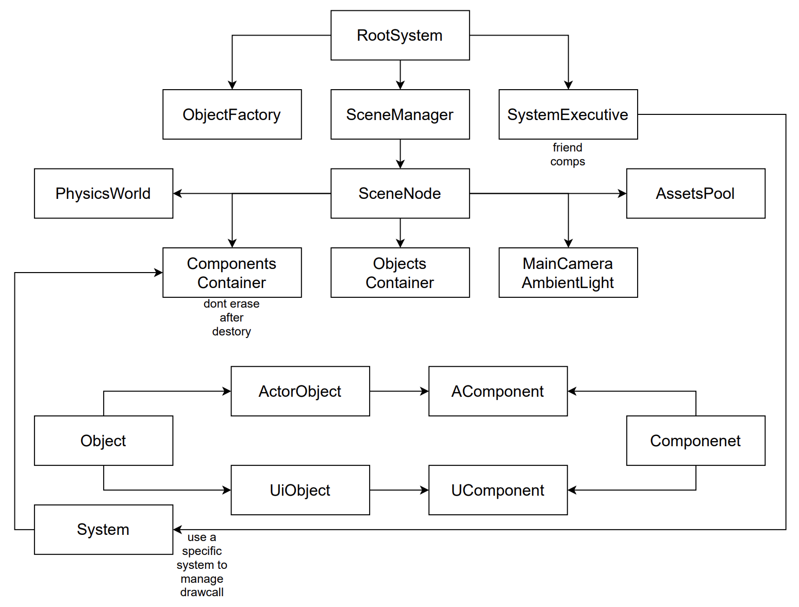
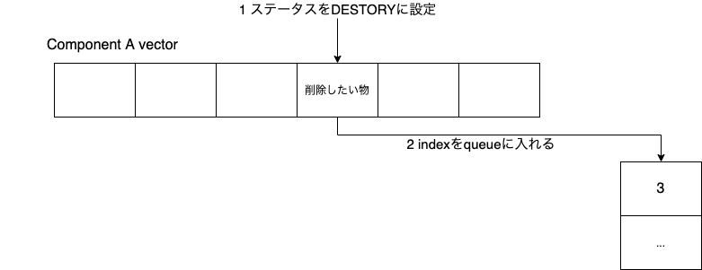
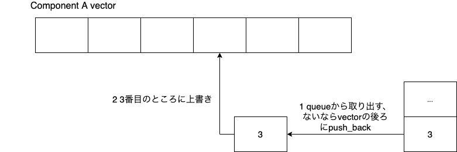

## HycFrame3Dについて
>HycFrame3DはWindowsをプラットフォームにして、汎用性が持っている通用3Dゲーム開発できるのフレームワークを目指して作った物であります。

- Entity-Component-Systemという考え方よりのソフトウェアアーキテクチャ
- 自由に構築可能な描画システム
- 柔軟性を持っているシーン設計
- 最も基本な機能を備えている

### 前身
このフレームワークの前身は大体半年前作っていた2Dゲーム開発ようのものです（今はHycFrame2Dという名をつけました）。

HycFrame2Dは様々の問題点があったり、座標系の仕様もなかなか変なので、3Dゲーム開発としては足りない部分あまりにも多くて、新しいフレームワークを作るという話になってきました。

最初目指した改善点お主に以下のもの：
- 汎用性が持っている座標系
- CPUキャッシュにより効率いい組み方
- もっと柔軟な描画パイプライン
- 3Dに必要なコンポーネントを導入

### コードの組み方
フレームワークの大体なアーキテクチャーは下のように幾つの部分に分けられています。

- 絶対必要なベースツール
- フレームワーク担当機能より利用している中間ツール・ファイル
- HycFrame3Dフレームワーク自体
- フレームワークに紐つけているファイル

各部分について詳しい説明をします。

**ベースツール**

- 短いても経過時間を測れるタイマー（deltatime計算用）
- ログを標準フォーマットで出力するプリンター（実行上の不具合やデバッグメッセージを出力欄にプリントアウト用）

**中間ツール・ファイル**

- JSONファイルを読み込み・解析できるツール関数（シーンファイル解析やコンフィギュレーションファイル解析などのところに利用しています）
- モデルファイルを読み込み、フレームワークが解析できるデータに変換するツール関数
- 音声ファイルを読み込みためのツール関数

**フレームワーク自体**

- Rootシステム（フレームワーク実体の起動・リリース・実行を管理する部分）
- Sceneシステム（シーンの切替え・リリース・当シーンの参照とかの機能を提供している部分）
- Factoryシステム（JSONファイルより新規シーンあるいは新規オブジェクトを生成する部分）
- Systemシステム（名前がちょっと怪しいが、これはECSの「S」の意味、全てのSystemを管理・駆動する部分）

**紐つけるファイル**

- 特定のSystemとComponentより呼び出す、特定なコード実行するの部分、関数ポインタでフレームワークにレジスター・紐付けています

フレームワークのソフトウェアアーキテクチャーについて、お主に次の図のように組み立ています。

前身としてのHycFrame2Dとの最大な改善点は、**ObjectとComponentの保存・管理の仕方**です。

HycFrame2D時のやり方は、ObjectとComponent全部`new`で生成されていて、各Objectは所属のComponentポインタを更新順より`std::vector`メンバー変数に入れて保存して、そして更新するときはこの配列にある全てのComponentを一個ずつ更新関数を呼び出すということです。

でもこういうやり方は問題点があります。まずComponentは全部バーチャル関数の形で更新を行うので、この部分はすでにパフォーマンスを下げている。その上、全てのObjectとComponentは`new`で生成して、全てのComponentの更新関数を呼ぶと、CPU Cacheにはほぼ利用されず、全部メモリからポインタの内容物を探したまで、CPUに読み込めないので、パフォーマンスはさらに下げられていると思います。

そこで、こういう問題を解決ため、HycFrame3Dのやり方は、各Scene Nodeに対して、一つのObjects Containerと一つのComponents Containerを用意しています。中には各種類のComponent型の`std::vector`とそのComponentポインタ型の`std::unordered_map`があります。事前に`vector.reserve(MAX_COMP_SIZE)`で十分な大きさを確保して、配列にあるComponentを増やしてもポインタが無効にならないようにしています。

SystemがComponentに対して更新処理はvector中のデータを使い、あるComponentのポインタを探すのは名前よりmapで検索を行っています。このような仕組みで、更新されているComponentはメモリに連続になって、CPU Cacheを利用して処理効率を上げますし、mapでの検索もO(1)に近い効率で行えます。

でもこれでもう一つ新たな問題を招いてしまいました、特定のComponentをリリースすると、後ろ全てのComponentは前に移るので、mapにあるポインタはずれてしまう可能性があります。

私のやり方は、ComponentのステータスをDESTORYに設定した後一旦そのまま置いておいて、同時にmapでポインタを探し出す。そして、ポインタとvectorの先頭ポインタよりこのComponentのindexを計算、ある`std::queue`に入れて、mapからこのComponentのポインタを削除すれば、削除の部分は完了。

そして追加する時、まずはその型のqueueから既存のindexを取り出す、vectorのindex番目のところに追加したい物に上書きすれば完成です。

### フレームを実行するため必要なもの（整合済）

- 03_InputDevice 入力処理ライブラリー
- 03_RenderSystem_DX11 DX11よりのレンダリングシステムライブラリー
- 04_WindowManager WIN32アプリ管理ライブラリー
- rapidjson JSONファイル解析ライブラリー
- bullet 物理演算用ライブラリー（使う部分は当たり判定だけ）

### フレームがサポートしている内容

### 改善点

### これで作っていた作品