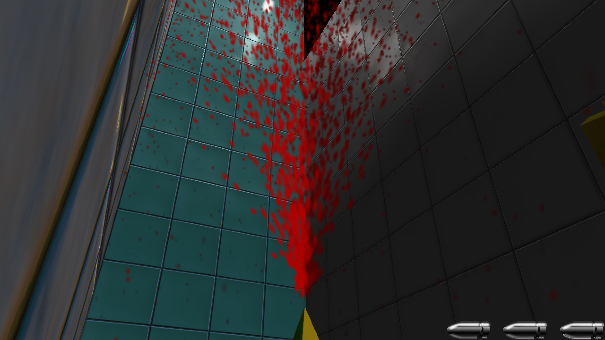

[【作品集　目次】](../projects_jp.md)

---


## HycFrame3Dについて

>HycFrame3Dは、Windows環境で通用3Dゲームを効率的に開発できることを目標として作った、自作汎用開発フレームワークです。

- Entity-Component-Systemを参考したソフトウェアアーキテクチャ
- 自由に構築可能な描画システム
- 柔軟なシーン仕組み
- 豊かな機能

**リンク**

- ソースコード

[](https://github.com/HIBICUS-CAI/HycFrame3D)

## 前身
このフレームワークの前身は、大体半年前に作った[2Dゲーム開発フレームワーク](hycframe2d_jp.md)です（今はHycFrame2Dという名をつけました）。

HycFrame2Dは様々の問題点があり、座標系の仕様もなかなか変なので、3Dゲーム開発としては足りない部分が多く、新しいフレームワークを作るという話になってきました。

前身と比べると、最初目指した改善点お主に以下のもの：
- 汎用な座標系
- CPUキャッシュでの実行効率向上
- 柔軟な描画パイプライン
- 3Dに必要なコンポーネントを導入

## コードの組み方
フレームワークのアーキテクチャーは以下のように幾つの部分に分けられています。

- 絶対必要なベースツール
- フレームワークの機能に利用される中間ツール・ファイル
- HycFrame3Dフレームワーク自体
- フレームワークに紐つけるコードファイル

各部分について詳しい説明をします。

**ベースツール**

- 短い経過時間を測れるタイマー（deltatime計算用）
- ログを標準フォーマットで出力するプリンター（実行上の不具合やデバッグメッセージを出力欄にプリントアウト用）

**中間ツール・ファイル**

- JSONファイルを読み込む・解析できるツール関数（シーンファイル解析やコンフィギュレーションファイル解析などのところに利用しています）
- モデルファイルを読み込み、フレームワークが解析できるデータに変換するツール関数
- 音声ファイルを読み込むためのツール関数

**フレームワーク自体**

- Rootシステム（フレームワーク実体の起動・リリース・実行を管理する部分）
- Sceneシステム（シーンの切替え・リリース・当シーンの参照とかの機能を提供している部分）
- Factoryシステム（JSONファイルにより新規シーンあるいは新規オブジェクトを生成する部分）
- Systemシステム（名前がちょっと怪しいが、これはECSの「S」の意味、全てのSystemを管理・駆動する部分）

**紐つけるファイル**

- 特定のSystemとComponentに呼び出され、特定なコードを実行する部分、関数ポインタでフレームワークにレジスター・紐付けられます

フレームワークのソフトウェアアーキテクチャーにつきまして、お主に図のように組み立ています。


## 特に頑張ったところ

前身としてのHycFrame2Dと比べて最大な改善点は、**描画パイプラインの進化**と**Object＆Componentの保存・管理の仕組み**です。描画パイプラインは[03_RenderSystem_DX11](https://github.com/HIBICUS-CAI/PreWorkRenderEngine)にかかっているので、[別の文章](rendersystem_jp.md)で紹介させていただきます。

ObjectとComponentを保存・管理するため、HycFrame2Dのやり方は、それらを全部`new`で生成し、各Objectは所属のComponentポインタを更新順で`std::vector`メンバー変数に入れて保存して、そして更新するときはこの配列にある全てのComponentの更新関数を一個ずつ呼び出しています。

でもこういうやり方は問題点があります。まずComponentの更新処理は全部バーチャル関数の形で行うので、この部分はすでにパフォーマンスを下げています。その上、全てのObjectとComponentは全部`new`で生成されてして、全てのComponentの更新処理を行う時、CPU Cacheにはほぼ利用されず、それぞれのポインタ指向物をメモリから探し出すまで、CPUに読み込めないので、パフォーマンスはさらに下げられていると思います。


このような問題を解決するため、HycFrame3Dのやり方は、各Scene Nodeに対して、一つのObjects Containerと一つのComponents Containerを用意しています。Components Containerの中には各種類のComponent型の`std::vector`とそのComponentポインタ型の`std::unordered_map`があります。その上、事前に`vector.reserve(MAX_COMP_SIZE)`で十分な大きさを確保しているので、配列に新しいComponentを入れてもポインタが無効にならないようにしています。

SystemでComponentに対する更新処理を行う時にはvector中のデータを使い、あるComponentのポインタを探す時には名前によりmapで検索を行っています。このような仕組みで、更新されるComponentはメモリに連続になって、CPU Cacheを利用して処理効率を上げますし、検索したい時もO(1)に近い効率で行えます。


でもこれはもう一つ新たな問題を招いてしまいました、特定のComponentをリリースすると、後ろ全てのComponentは前に移るので、mapにあるポインタはずれてしまう可能性があります。

私のやり方は、ComponentのステータスをDESTORYに設定した後一旦そのまま置いておいて、同時にmapでポインタを探し出す。そして、ポインタとvectorの先頭ポインタによりこのComponentのindexを計算、ある`std::queue`に入れて、mapからこのComponentのポインタを削除すれば、削除の部分は完了。


そして追加する時、まずはその型のqueueから既存のindexを取り出す、vectorのindex番目のところに追加したい物を上書きすれば完成です。


HycFrame2Dを開発するときはまだECSのSystemがどのような役を担当しているかわかっていなかったが、今はその重要性への理解を一歩深くにしたと思います。

## フレームを実行するため必要なもの（整合済）

- [03_InputDevice](https://github.com/HIBICUS-CAI/PreWorkRenderEngine) 自作入力処理ライブラリー
- [03_RenderSystem_DX11](https://github.com/HIBICUS-CAI/PreWorkRenderEngine) DX11によりの自作レンダリングシステムライブラリー
- [04_WindowManager](https://github.com/HIBICUS-CAI/PreWorkRenderEngine) 自作WIN32アプリ管理ライブラリー
- [MyMeshConverter](https://github.com/HIBICUS-CAI/SelfTools/releases/tag/MyMeshConverter-v1.1) 異なる拡張子のモデルファイルを統一フォーマットに変換できる自作ツール
- [rapidjson](https://github.com/Tencent/rapidjson) JSONファイル解析ライブラリー
- [bullet](https://github.com/bulletphysics/bullet3) 物理演算用ライブラリー（使う部分は当たり判定だけ）

```
> .\MyMeshConverter.exe
Have 1 arguments:
.\MyMeshConverter.exe

  -type : file style to save info
        json-pretty :   convert into formated json
        json-normal :   convert into unformated json
        binary :        convert into binary file

  -flag : the flag pass to assimp to process mesh
        left-hand :     process mesh to LH coord
        right-hand :    process mesh to RH coord
        optimize :      process with optimzie flag

  -input : the model file you want to convert
        [file name] :   the file's name without path
```

## フレームがサポートしている内容

お主に三つの内容に分けられています：

- 紐付けた関数により特別挙動をカスタマイズできるInputComponent & InteractComponet
- InputとInteract以外多様な機能を提供しているComponents
- その他
  - SceneNode管理
  - Object管理

詳しい内容は以下の通り：

| Component種類                         | 提供している機能                                                                                                                                                                                                                        |
| ------------------------------------- | --------------------------------------------------------------------------------------------------------------------------------------------------------------------------------------------------------------------------------------- |
| (Actor&UI)<br>[A/U]TransformComponent | Objectの位置、角度と大きさ調整<br>１フレーム前のデータをバックアップ<br>このフレーム内に編集されたデータをロールバック                                                                                                                  |
| (Actor&UI)<br>[A/U]TimerComponent     | 複数のタイマーを作成<br>特定タイマーの開始、一時停止、リセット処理<br>ある時間に越えたどうかの判断                                                                                                                                      |
| (Actor&UI)<br>[A/U]InputComponent     | レジスターされた入力関数を入力処理段階で自動的に呼び出す<br>Unity C# Scriptのような処理をカスタマイズできる仕組み                                                                                                                       |
| (Actor&UI)<br>[A/U]InteractComponent  | レジスターされた初期化関数を初期化段階で自動的に呼び出す<br>レジスターされた更新用関数を更新段階で自動的に呼び出す<br>レジスターされたリリース関数を削除する時自動的に呼び出す<br>Unity C# Scriptのような処理をカスタマイズできる仕組み |
| (Actor&UI)<br>[A/U]AudioComponent     | ロードされた音声データをBGMとSEの形で再生                                                                                                                                                                                               |
| (Actor)<br>[A]CollisionComponent      | Collision ShapeとCollision Object生成<br>あるObjectとの当たり判定<br>当たっている場所の世界空間座標を計算                                                                                                                               |
| (Actor)<br>[A]MeshComponent           | モデルのInstanceを新規作成<br>モデル描画サポート<br>複数のモデルをグループ化して同じTransformデータで表示する                                                                                                                           |
| (Actor)<br>[A]LightComponent          | 光源を作成する<br>光源のBloomと照度についてのデータを動的編集                                                                                                                                                                           |
| (Actor)<br>[A]ParticleComponent       | パーティクルエミッターを作成する<br>エミッターの終始大きさ、終始色、噴出物理量とかのデータを動的編集                                                                                                                                    |
| (UI)<br>[U]SpriteComponent            | テクスチャ描画サポート<br>UV値調整<br>色の偏移量調整                                                                                                                                                                                    |
| (UI)<br>[U]AnimateComponent           | 複数のスプライトアニメーションの読み込み<br>特定のアニメーションに変わる<br>再生速度調整                                                                                                                                                |
| (UI)<br>[U]ButtonComponent            | 隣のボタンを選択する機能<br>このボタンは選択されているかどうかの判断<br>カーソルとキーボード操作サポート                                                                                                                                |

<br>

| ほかの内容    | 機能                                         |
| ------------- | -------------------------------------------- |
| SceneNode管理 | シーンの新規作成<br>次のシーンに遷移         |
| Object管理    | 動的作成・削除<br>所属のComponentsの一括管理 |

**グラフィックカード配置**

毎秒のフレーム数が足りない場合（60以下）、まずフレームワークは正しいグラフィックカードを使用しているかどうかを確認してください。

フレームワークは自動的により正しいグラフィックカードを選択していますが、もし万が一違うものに選んだら、ご自分で正しいグラフィックカード番号をコンフィグレーションファイルに記入する必要があります。

記入方は以下の通り：

- フレームワークを一度実行して（**実行しないと出てこないです**）`HycFrame3D/Assets/Configs/AutoCreated_AdapterInfoInSystem.txt`を開く

    

- `HycFrame3D/Assets/Configs/render-deviceconfig.json`を開いて、**使いたいグラフィックカードの番号**を`force-adapter-index`後ろ`null`のところに上書きして保存してください。（nullはフレームワークにより自動的に選択するという意味です）

## 改善点

私の視点からこのフレームワークはそこそこ出来ていると思うが、まだ完備とは言えません。色々な改善すべき点はまだ残っています。

- Scene管理
  - 現在のDrawCallは選別せず一気にレンダリングシステムに渡しています、Instanceを利用しているが、異なるモデルの数が沢山増えたらかなりの無駄作業が出てしまうので、OctTreeやBSPなどの技術を導入すべきです
- マルチスレッド
  - System実行の部分はそれぞれに優先順位を付けて、マルチスレッドで駆動すると実行効率を一層上がれるかもしれません
  - RenderSystemのContainerはマルチスレッドでの安全動作がまだできないので、HycFrame2Dのようなマルチスレッドベースのシーン遷移はまだできないです
- 音声操作
  - できれば3D空間のようなSE再生機能を作って欲しいです
  - XAudioに関する内容をもっと勉強する必要があります
- キャッシュ最適化
  - 現在のキャッシュ利用率はただ以前のものと比べて優れているだけ、でも色んなところはまだ全然Cache Friendlyと言えないので、もっと効率いいデータ構造が必要です。
- 機能追加
  - できればモデル（FBXとか）のアニメーションも導入できるようにしたいです
  - カメラを追加、操作できるComponentを導入したいです
  - 文字列をそのままテクスチャに変更できる技術が欲しい、freetypeに関する内容を勉強すべきです
- AI向き
  - AIをもっと簡単に動けるように、マップにNodeを付ける手段や関連Componentが欲しいです
  - 効率いい道調べ方法（A*を改善）を勉強する必要があります

できたら追々に追加する予定です。

## 他の情報

- 開発期間：設計約二ヶ月、実装約一週間
- 開発ツール：Visual Studio、Visual Studio Code、RenderDoc、Git

## これで作っていた作品


>JADEITEとは、翡翠のことです。
>
>2DインディーズゲームCELESTEを3D版に拡張したゲームです。

詳しい内容はこの[ページ](jadeite_jp.md)ご覧ください

簡易PV↓

<video src="https://user-images.githubusercontent.com/48410127/149282080-22c38ba0-218d-41e1-9042-165fc1cbed2f.mp4" controls="controls" style="max-width: 100%;"></video>

スクリーンショット↓





---

[【作品集　目次】](../projects_jp.md)