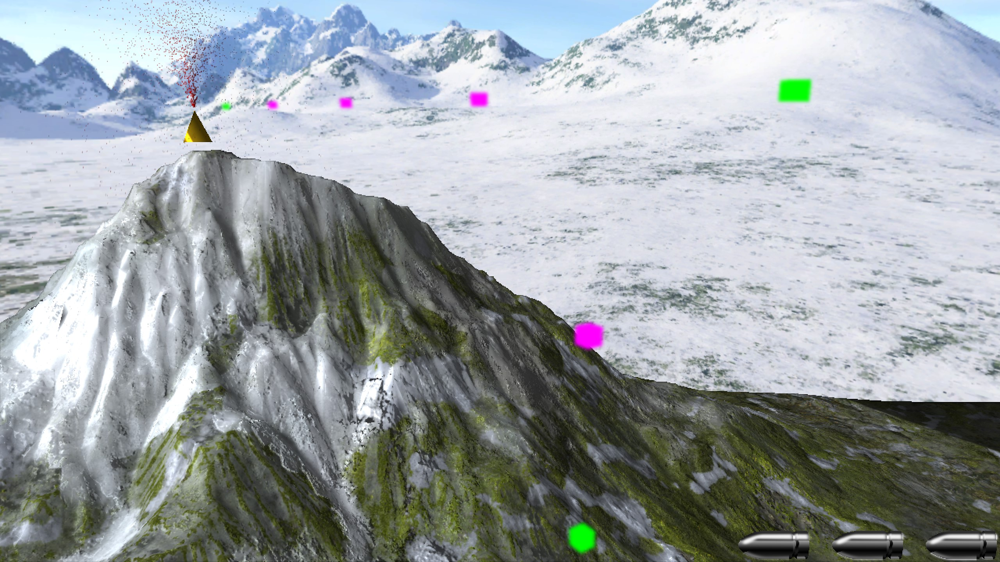
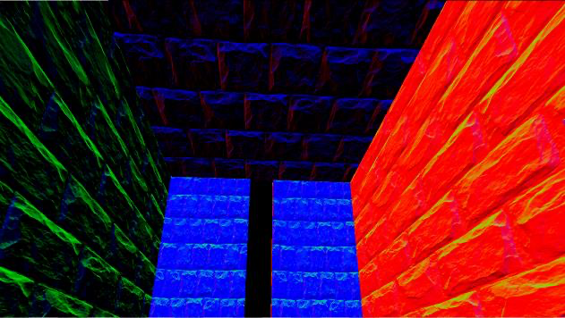
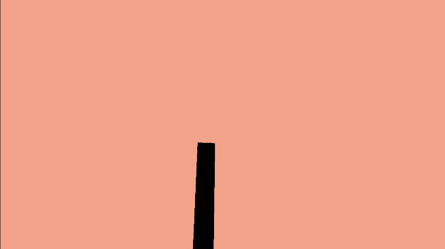
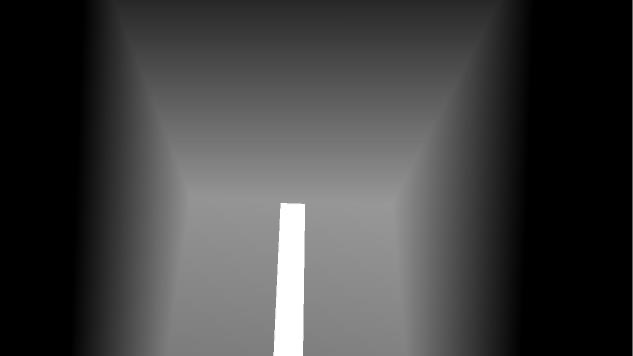
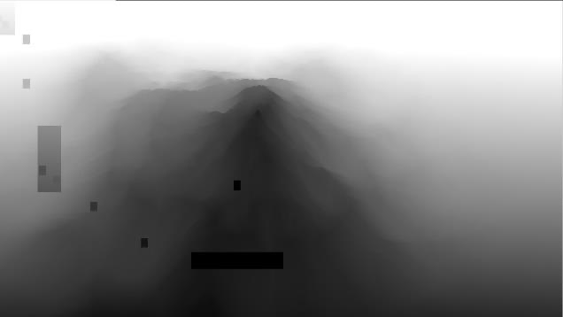

## JADEITEについて
>JADEITEは、翡翠のこと。CELESTEに模倣して作った3Dバージョンです。

## 入力サポートと操作方法

サポートされているデバイスは三つあります：**キーボード＋マウス**、**XBOXコントローラー**、**PS4コントローラー**。ほかのコントローラーはボタンのレイアウトがずれてしまう可能性があるのでご注意ください。

コントローラーはゲーム開始する前、事前に設定しておいてください。 コントローラーがついている場合でも、キーボード＋マウスで操作することはできます。

操作方法については入力デバイスに分けて説明させていただきます（チュートリアルのところには合わせて説明しています）。

- キーボード＋マウス
  - **ボタン選択**：カーソルを上に移動・上下左右のキー
  - **ボタンクリック**：マウス左クリック・ENTERキー
  - **移動**：WASDキー
  - **カメラ**：マウス
  - **ジャンプ**：SPACEキー
  - **ダッシュ**：左のALTキー
  - **銃を構える**：マウス右クリック（押し続く）
  - **弾を撃つ**：銃を構える上にマウス左クリック
  - **一時停止**：ESCキー
- コントローラー（GamePad）
  - **ボタン選択**：左側の方向ボタン
  - **ボタンクリック**：右側の下のボタン（A・×）
  - **移動**：左スティック
  - **カメラ**：右スティック
  - **ジャンプ**：右側の下のボタン（A・×）・左肩の前のボタン（L1・ LB）
  - **ダッシュ**：右肩の前のボタン（R1・RB）
  - **銃を構える**：左肩の後ろのボタン（L2・LT）
  - **弾を撃つ**：銃を構える上に右肩の後ろのボタン（R2・RT）
  - **一時停止**：右側のメニューボタン（OPTIONS・≡）

## ゲームシステム

ダッシュ操作を中心に、山に登るゲームです。

ダッシュはカメラが向いている方向に高速移動するというスキルです、 従って、ダッシュ方向も平面ではなく、上や下にもできます。

だがダッシュは地面と接触してないとき、一回しかできません。

ダッシュしている、あるいはダッシュした後、ダッシュパワーを空でも回復できるため、緑色とピンク色で光っている水晶を作りました。緑の方はそのまま当たるとできます、ピンクの方はまず弾を撃って、ピンクから青までになったあと当たると回復できます。

プレイヤーには弾丸エネルギー三個分持っています、銃を構えるときは 弾丸エネルギーをだんだん消費します、弾丸を撃つとき今未だ完全に消費されていないエネルギーを消費します。（例えば：元々は 3.0、銃を構えるため 2.6 になった、そして撃ったあと 2.0 になる）

銃を構えるとき、プレイヤーの移動速度が遅くなります、移動距離はそのまま減られません。これによって、プレイヤーは精密操作あるいは細かい位置調整ができます。

終点には回っている黄金の火山があります。それと当たるとゴールです。

## OPTIONS調整

毎秒のフレーム数が足りない場合（60以下）、先ずゲームのフレームワークは正しいグラフィックカードを使用しているかどうかを確認してお願いします。

このフレームワークは自動的により正しいグラフィックカードを選択していますが、もし万が一違うものに選んだら、どうかご自分で正しいグラフィックカード番号をコンフィグレーションファイルに記入お願いします。

記入方は以下の通り：

- ゲームを一度実行して（**実行しないと出てこないです**）`(HycFrame3D/)Assets/Configs/AutoCreated_AdapterInfoInSystem.txt`を開く

    

- `(HycFrame3D/)Assets/Configs/render-deviceconfig.json`を開いて、**使いたいグラフィックカードの番号**を`force-adapter-index`後ろ`null`のところに上書きして保存してください。（nullはフレームワークより自動的に選択するという意味です）

**もしそうしてもFPSはまだ足りない場合**、`(HycFrame3D/)Assets/Configs/render-effect-config.json`を開いて調整を行ってください。

- `(HycFrame3D/)Assets/Configs/render-effect-config.json`を開く

    

- `ssao-blur-loop-count`の数を`0`から`4`まで調整して保存、`0`に近いと処理量が少ない、大きくと処理量が多い
- `filter-level`後ろの数を`0`から`3`まで調整して保存、`0`に近いと処理量が少ない、`3`に近いと処理量が多い
- まだ足りない場合、`particle-off`後ろの`false`を`true`にしてください（ですが、こうしたらビジュアル的にはちょっと減られると思います）

## プレイ動画

<iframe width="100%" height="auto" src="https://www.youtube.com/embed/-1hSB3A7lp8" title="YouTube video player" frameborder="0" allow="accelerometer; autoplay; clipboard-write; encrypted-media; gyroscope; picture-in-picture" allowfullscreen></iframe>

## アピールしたいところ

- ゲームシステムはCELESTEを参照しました、簡単な操作でも色んな組合せができます
     
- [フレームワーク](hycframe3d_jp.md)よりの柔軟性
- 画面です、次のページにこのゲームが使っている描画パイプラインについて説明します

---

1. 描画パイプライン開始
2. MRTでDiffuseテクスチャカラー、世界空間法線（必要なところにバンプマッピングを利用）、世界空間座標、マテリアルのDiffuse AlbedoとFresnel R0とShininessと奥行きを描画

    |シーン1|シーン2|
    |:---:|:---:|
    |||
    |||
    |||
    |||
    |||
    |||

3. 法線と奥行きによってSSAO（スクリーンスペース・アンビエント・オクルージョン）処理を行う、そして再び法線と奥行きによってEdge-preserving Smoothingを行う（エッジを崩さないブラー）

    |シーン1|シーン2|
    |:---:|:---:|
    |||
    |||

4. 影が出る光源から奥行きでシャドウマップを描画

    |シーン1|シーン2|
    |:---:|:---:|
    |||

5. MRTで描画したものとSSAOマップとシャドウマップを合わせて、遅延レンダリングを行う（Deferred Rendering）

    |シーン1|シーン2|
    |:---:|:---:|
    |||

6. スカイボックス（Skybox）を描画する

    |シーン1|シーン2|
    |:---:|:---:|
    |||

7. 光源の描画と結果をブラーして作り出したシンプルなブルーム（Bloom）、そしてメインRTVにブレンド

    |シーン1|シーン2|
    |:---:|:---:|
    |||
    |||
    |||

8. Compute Shaderでパーティクル生成、演算、カーリング、タイルレンダリング（particle emit, simulation, culling, tile rendering）
9.  パーティクルをメインRTVにブレンド

    |シーン1|シーン2|
    |:---:|:---:|
    |||

10. UIなどのSprite描画

    |シーン1|シーン2|
    |:---:|:---:|
    |||

11. パイプライン完成

詳しい内容はレンダリングシステムについてのページをご覧ください。