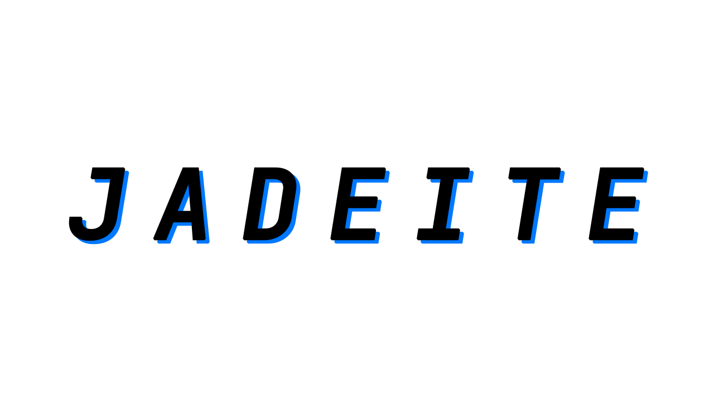
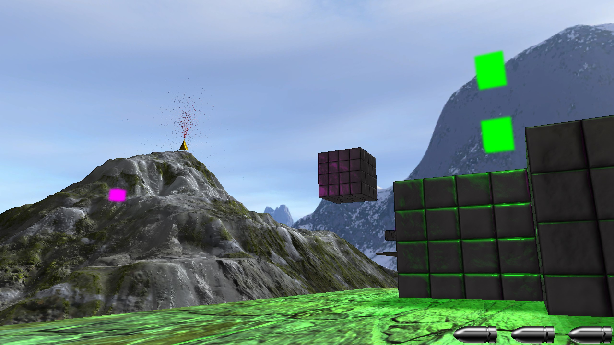

## JADEITEについて
>JADEITEは、翡翠のこと。CELESTEに模倣して作った3Dバージョンです。

## 入力サポートと操作方法

サポートされているデバイスは三つあります：**キーボード＋マウス**、**XBOXコントローラー**、**PS4コントローラー**。ほかのコントローラーは ボタンのレイアウトがずれてしまう可能性があるのでご注意ください。

コントローラーはゲーム開始する前、事前に設定しておいてください。 コントローラーがついている場合でも、キーボード＋マウスで操作するこ とはできます。

操作方法については入力デバイスに分けて説明させていただきます（チ ュートリアルのところには合わせて説明しています）。

- キーボード＋マウス
  - **ボタン選択**：カーソルを上に移動・上下左右のキー
  - **ボタンクリック**：マウス左クリック・ENTERキー
  - **移動**：WASDキー
  - **カメラ**：マウス
  - **ジャンプ**：SPACEキー
  - **ダッシュ**：左のALTキー
  - **銃を構える**：マウス右クリック（押し続く）
  - **弾を撃つ**：銃を構える上にマウス左クリック
  - **一時停止**：ESCキー
- コントローラー（GamePad）
  - **ボタン選択**：左側の方向ボタン
  - **ボタンクリック**：右側の下のボタン（A・×）
  - **移動**：左スティック
  - **カメラ**：右スティック
  - **ジャンプ**：右側の下のボタン（A・×）・左肩の前のボタン（L1・ LB）
  - **ダッシュ**：右肩の前のボタン（R1・RB）
  - **銃を構える**：左肩の後ろのボタン（L2・LT）
  - **弾を撃つ**：銃を構える上に右肩の後ろのボタン（R2・RT）
  - **一時停止**：右側のメニューボタン（OPTITIONS・≡）