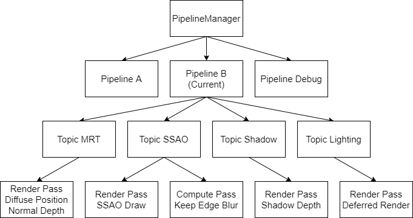

## レンダリングシステムライブラリーについて

>異なるスタイルのレンダリングをサポートできる柔軟性を持って、Windowsプラットフォームでのリアルタイムレンダリングライブラリー

このライブラリーは、レンダリングパイプラインを容易に構築できるため開発したものであります。

コンテンツは主に以下の通り分けられています :

- パイプラインシステム
  - パイプライン Pipeline（複数のトピックより組み立てる）
  - トピック Topic（複数のパスより組み立てる）
  - パス Pass（特定のDraw・Dispatchを行うオブジェクト）
- ほかのサブシステム
  - DirectXデバイス管理
  - カメラ作成・管理
  - 光源作成・管理
  - パーティクル作成・管理
  - Mesh作成・読み込み・管理
  - DrawCall管理
  - リソース管理
  - 静的リソース参照

レンダリングシステムライブラリーは、サブシステムにサポートされて、**異なるトピックより柔軟なレンダリングパイプラインを構築**、その中に必要なパイプラインで描画するという仕組みです。

例えば、[HycFrame3D](hycframe3d_jp.md)より作ったゲーム[JADEITE](jadeite_jp.md)の描画パイプラインは以下の順で、複数のトピックより構築されています :

`Diffuse+Normal+Position+Material+Depth Topic` → `SSAO Topic` → `Shadow Map Topic` → `Deferred Rendering Topic` → `Skybox Topic` → `Bloom Topic` → `Particle Topic` → `UI Topic`

## パイプラインシステム

- **Pipeline** どうやって一つのフレームを描画するの最高単位
- **Topic** ある効果を得るため一連の処理
- **Pass** 一つの処理がどう動作するを指示する、描画の最小単位

私の理解より、リアルタイム（特にゲーム）のレンダリングは、同一のデータ異なる手段で色々なテクスチャに変換して、最後これらのテクスチャを併合し、最終バッファーに書き込むという流れです。

そしてそういう「異なる手段」を柔軟に実行・追加・削除・編集できるため、私は一回の描画を一つのパイプラインの実行に、異なる手段をそれぞれのトピックにまとめました。

最後は使いたいPipelineを実行して、その中の全てのTopicが自動的に実行されます。

例えば影を描画するためShadow Mapを作りたいなら、以下のように処理を行うとすぐ実現できます。

1. `RSPass_Base`を継承して奥行きだけ描画する`RSPass_ShadowMap`クラスを作成する
2. `RSPass_ShadowMap`を確保する
3. 新しい`RSTopic`を作成、名を`shadow-topic`にして、さき確保した`RSPass_ShadowMap`のオブジェクトをこのTopicに追加し、実行順を設定する
4. `shadow-topic`を入れたいPipelineに追加、実行順を設定する

もし間違いがないなら、Pipelineを実行するとちゃんと動けるはずです。

図に言うと主に以下のように :

## ライブラリーデータコンテンツとサブシステム

- メインのデータコンテンツ（RSCommon.hにあるもの）
  - 定数

  |            名前            |  値   |                    意味                    |
  | :------------------------: | :---: | :----------------------------------------: |
  | MAX_STRUCTURED_BUFFER_SIZE |  256  |      StructuredBuffer構造体数の最大値      |
  |     MAX_INSTANCE_SIZE      |  256  | 単一DrawCallに関連するInstance個数の最大値 |
  |       MAX_LIGHT_SIZE       |  256  |                光源数最大値                |
  | MAX_PARTICLE_EMITTER_SIZE  |  256  |        パーティクルエミッター最大値        |
  |      MAX_SHADOW_SIZE       |   4   | ShadowMapで描画できる影付き光源数の最大値  |
  |        MESH_TEX_MAX        |  10   |  単一Meshに添付できるテクスチャ数の最大値  |
  |      RS_INVALID_ORDER      |   0   |          無効なPass・Topic実行順           |

  - 列挙型

  |       名前       |                  意味                  |
  | :--------------: | :------------------------------------: |
  |    PASS_TYPE     |             Passの実行種類             |
  |   LAYOUT_TYPE    |           InputLayoutの種類            |
  |  DRAWCALL_TYPE   |       透明不透明等のDrawCall種類       |
  |    LENS_TYPE     |            カメラの投影種類            |
  |    LIGHT_TYPE    |              点光源の種類              |
  | PARTICLE_TEXTURE | ビルボードパーティクルのテクスチャ種類 |
  |  TOPOLOGY_TYPE   |           ポリゴンの組立方式           |
  | RS_RESOURCE_TYPE |          GPU側のリソース種類           |

  - 構造体

  |           名前            |                       意味                       |
  | :-----------------------: | :----------------------------------------------: |
  |         CAM_INFO          |           カメラを作成するための構造体           |
  |        RS_CAM_INFO        |       ライブラリーが直接扱えるカメラデータ       |
  |        LIGHT_INFO         |            光源を作成するための構造体            |
  |       RS_LIGHT_INFO       |        ライブラリーが直接扱える光源データ        |
  |   PARTICLE_EMITTER_INFO   |         エミッターを作成するための構造体         |
  | RS_PARTICLE_EMITTER_INFO  |     ライブラリーが直接扱えるエミッターデータ     |
  |       MATERIAL_INFO       |         マテリアルを作成するための構造体         |
  |     RS_MATERIAL_INFO      |     ライブラリーが直接扱えるマテリアルデータ     |
  |       SUBMESH_INFO        |          単一Meshを作成するための構造体          |
  |      RS_SUBMESH_DATA      | ライブラリーが直接扱える単一Meshデータ（保存用） |
  | RS_SUBMESH_DRAWCALL_DATA  |       Meshを描画ため必要なデータ（描画用）       |
  |     RS_INSTANCE_DATA      |               扱えるInstanceデータ               |
  | RS_INSTANCE_DRAWCALL_DATA |          各DrawCall添付するInstance集合          |
  |   RS_MESH_TEXTURE_INFO    |    Meshを描画するため添付するテクスチャデータ    |
  |       RS_MISC_INFO        |             描画が利用可能な雑データ             |
  |     RS_DRAWCALL_DATA      |        一つのDrawCallに関する全てのデータ        |
  |     RS_RESOURCE_INFO      |           GPU側のリソースの標識データ            |

- サブシステム
  - **レンダリングデバイス管理システム** レンダリングシステムを駆動するデバイスに関する管理
  - **カメラ管理システム** カメラ操作・編集に関する処理
  - **光源管理システム** 光源操作・編集に関する処理
  - **パーティクルエミッター管理システム** エミッター操作・編集に関する処理
  - **Mesh処理サポートシステム** 頂点データ・ジオメトリデータよりMeshデータを生成するシステム
  - **リソース管理システム** GPU側のリソース管理に関する処理
  - **静的リソース参照システム** 事前に用意したリソースの参照の提供
  - **DrawCallプール** アップロードされた各種類のDrawCallを保存する所
  - **Pipeline管理システム** Pipelineを入れ替え・追加・削除に関する処理

## 自分なりに頑張ったところ

- 柔軟な組立

  こういう柔軟性は複雑なTopicで特に役立っています。例えば、パーティカルのシミュレーションを行いたい場合、Emit、Simulate、Tile Render、BlendをそれぞれのPassにすると、描画仕方が見やすいしデバッグも問題を早く特定できると思います。もしぐちゃぐちゃに組み立てば、他の人がコード読むと戸惑うし、もしバッグがあればどっちが原因も分かりづらいでしょう。

- マルチスレッドに適性がいい

  DirectX11のマルチスレッドは、主にCPU側のコード実行速度を上げるための機能と考えています。そして処理をPassやTopicで分けると、特別な処理がなくてもコードの実行はほぼ平均に各スレッドに分けられるので、並行性を上げられます。実際、このライブラリーのデフォルト設定は、Topicを単位にマルチスレッドで駆動しています。

  また、DirectX12のCommandQueueとCommandListの実装は未だですが、細部を少しいじればそのまま適用できるではないかと思います。

- 拡張性

  各システムの関連処理は全部事前に宣言した構造体で行っているので、お互いの編集・追加も簡単にできますし、もしほかのものを入れたいなら、固定な構造体に梱包してすぐに使えると考えています。

## 改善すべきところ

- マルチスレッドへの対応

  パイプラインシステム以外のサブシステム、特に光源管理とカメラ管理システム、は普通の`vector`等のSTLコンテナーを利用しているので、マルチスレッド環境の対応が未だできていません。そのせいで、HycFrame3DはHycFrame2Dのようなダイナミックのローディング画面を作れず、怪しいの間が残られてしまいます。

- もっと現代的なAPIを利用

  DirectX11はとても便利なAPIですが、DirectX12やVulkanと比べると性能が低いし、レイトレーシングもサポートしていないようです。加えてレイトレーシングはラスタライズよりもっとリアルなライティングができ、未来のリアルタイムレンダリング処理の主流になると考えています。
  
  よって、現段階ではそこそこ動けますが、新技術の勉強を怠けず、もっと高性能かつ現代的なレンダリングシステムにブラシュアップ所存です。