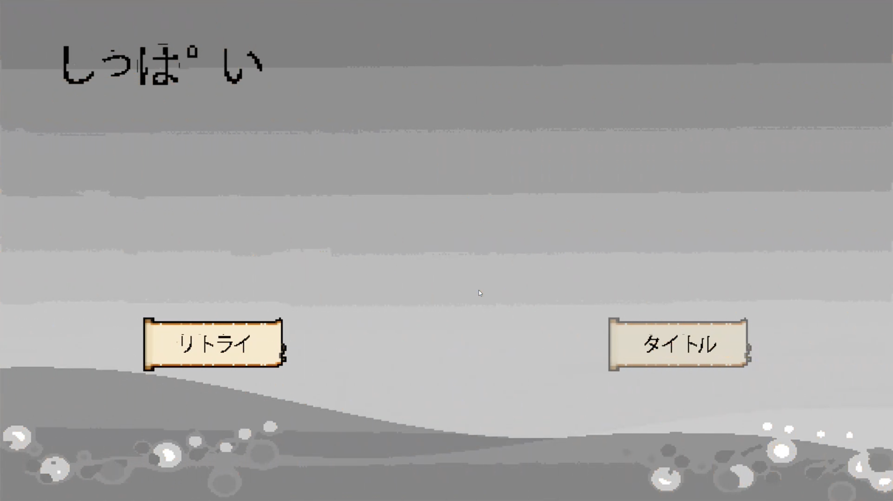

[【作品集　目次】](../projects_jp.md)

---

## 大羿射日について

>「大羿射日」とは、古中国の英雄神話です。

太古の時、空には十個の太陽があり、その熱さのせいで民が苦しんでいた。そしてこれは、プレーヤーは英雄「羿」になり、Joyconを使って天から狂っている太陽を射落とし、皆を救うというスイッチゲームです。

さらに、射落された太陽を使って、太陽神たちのドッジボール大会というミニーゲームも友達と楽しめます。

フレームワーク[HycFrame2D](hycframe2d_jp.md)により開発しまして、2021HAL三校合同コンテストで技術賞受賞したゲームです。

**リンク**

- [ソースコード（Windowsバージョン）](https://github.com/HIBICUS-CAI/HycFrame2D/tree/EXAMPLE-BowAndArrow-DO-NOT-EDIT)

**スイッチでのバイナリファイルは提供できませんので、ご了承ください。**

## PV動画

<iframe width="100%" height="500" src="https://www.youtube.com/embed/prv0hxfCRGs" title="YouTube video player" frameborder="0" allow="accelerometer; autoplay; clipboard-write; encrypted-media; gyroscope; picture-in-picture" allowfullscreen></iframe>

## ゲームシステム

このゲームは二つの部分に分けられています :

- 本編としての太陽シューティング

    スティックかつボタン方式、或いはモーション操作方式でのシューティングゲームです。
    
    弓を制御し、行き先を太陽の移動路線と合わせて矢を発射して、上手くいけば矢が太陽と当てられ、それを消すことができます。天から全ての太陽を消したらゲームクリアです。

    
    
    天に太陽がある限り、畑はだんだん焦げてしまいます（背景は普通の色から焦げる色に変換）。

    

    
    
    また、毎回矢を射出する時、弦にかかった力の大きさにより弓のHPも減られます、HPが0になったら弓が折られます。

    

    
    
    畑が一定程度に焦げたら、或いは弓が折られてしまうとゲームオーバーです。つまり、一定時間内に、かつ、弓のHPが使い切る前に全ての太陽を射落とすというゲームシステムです。

    

    

- EXTRAとしての太陽神ドッジボール

    これは対面でのマルチプレーヤー遊びモードです。

    
    
    各プレーヤーはそれぞれ一つのjoyconを持って、自分側の太陽神を操作し、場にある太陽を拾って向こうに狙って投げ出す、三回当たったら勝というミニーゲームです。

    

## アピールしたいところ

**本物の弓の操作感**

このゲームを作りたいきっかけは、せっかくスイッチ開発マシンを触れるチャンスを逃れず、スイッチではないと遊べないゲームを試したいという考えです。

そして「リングフィット」を知り、本物のような弓と弦の操作感をゲームにすることを思いつきました。

左のjoyconを弓のように持って、右のjoyconを弦に構えた矢のように後ろに引っ張ったら、加速度とジャイロセンサー入力によりモーション操作ができ、HD振動の出力により張り切っている弦の振動感も感じられます。

本当の弓の操作感を再現するため、この部分は精一杯力込めて調整していました。

## 他の情報

- 開発期間：実装（フレームワーク開発期間抜き）約二週間
- 開発ツール：HycFrame2D、Visual Studio、Visual Studio Code、Git

---

[【作品集　目次】](../projects_jp.md)