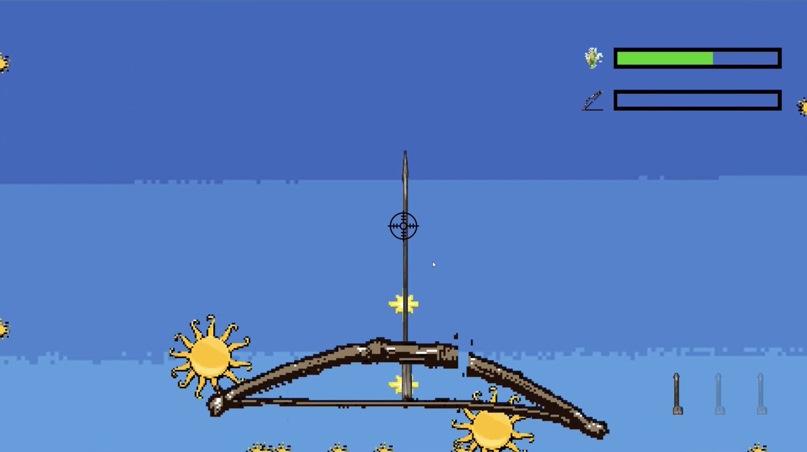
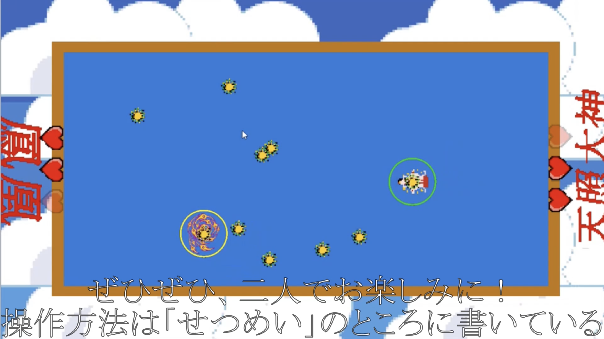

## 大羿射日について

>「大羿射日」とは、古中国の伝説の英雄神話。

太古の時、天に十個の太陽があり、その熱さのせいで民が苦しんでいた。そしてこれは、プレーヤーは英雄「羿」になり、Joyconを使って天から狂っている太陽を射落として、皆を救うというスイッチゲームです。

さらに、射落された太陽を使って、太陽神たちのドッジボール大会というミニーゲームも友達と楽しめます。

[HycFrame2D](hycframe2d_jp.md)より開発しました。

## ゲームシステム

このゲームは二つの部分に分けられています :

- 本編としての太陽シューティング

    スティックかつボタン方式、或いはモーション操作方式でのシューティングゲームです。
    
    弓を制御し、行き先を太陽の移動路線と合わせて矢を発射して、上手くいけば矢が太陽と当てられ、それを消すことができます。全ての太陽を消したらゲームクリアです。

    
    
    天に太陽がある限り、畑はだんだん焦げてしまいます（背景は普通の色から焦げる色に変換）。

    

    
    
    また、毎回矢を射出する時、弦にかかった力の大きさより弓のHPも減られます、HPが0になったら弓が折られます。

    

    
    
    畑が一定程度に焦げたら、或いは弓が折られてしまうとゲームオーバーです。つまり、一定時間内に、かつ、弓のHPが使い切る前に全ての太陽を射落とすというゲームシステムです。

    

    

- EXTRAとしての太陽神ドッジボール

    これはマルチプレーヤーの遊びモードです。

    
    
    各プレーヤーはそれぞれ一つのjoyconを持って、自分側の太陽神を操作し、場にある太陽を拾って向こうに狙って投げ出す、三回当たったら勝というミニーゲームです。

    

## PV動画

<iframe width="100%" height="500" src="https://www.youtube.com/embed/prv0hxfCRGs" title="YouTube video player" frameborder="0" allow="accelerometer; autoplay; clipboard-write; encrypted-media; gyroscope; picture-in-picture" allowfullscreen></iframe>

## アピールしたいところ

**本物の弓の操作感**

このゲームを作ったきっかけは、せっかくスイッチ開発マシンを触れるチャンスので、スイッチではないと遊べないゲームを試したいという考えです。

そして「リングフィット」を知り、本物のような弓と弦の操作感をゲームにすることを思いつきました。

左のjoyconを弓のように持って、右のjoyconを弦に構えた矢のように後ろに引っ張ったら、加速度とジャイロセンサー入力よりモーションで操作でき、HD振動の出力より張り切っている弦の振動感も感じられます。

本当の弓の操作感を再現するため、この部分は結構力込めて調整していました。