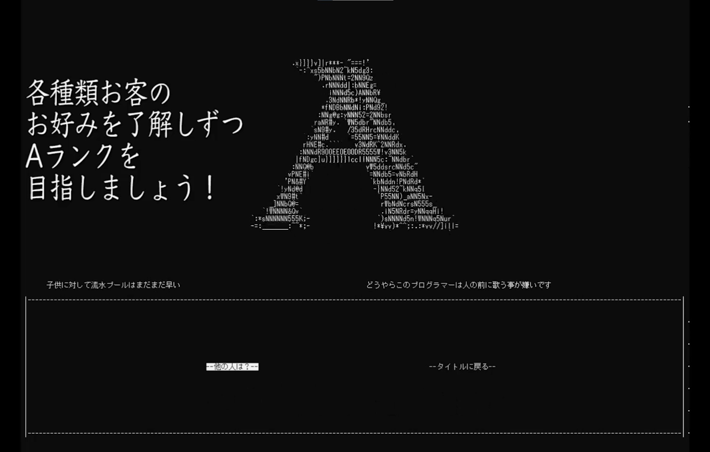
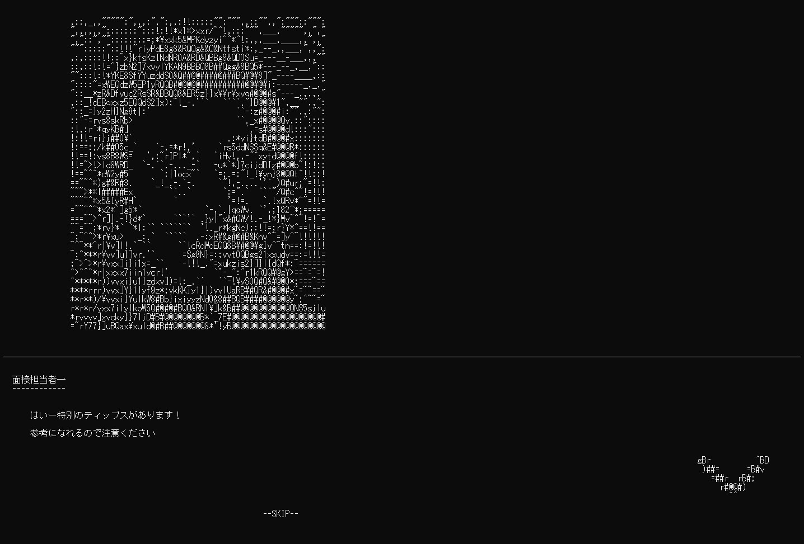
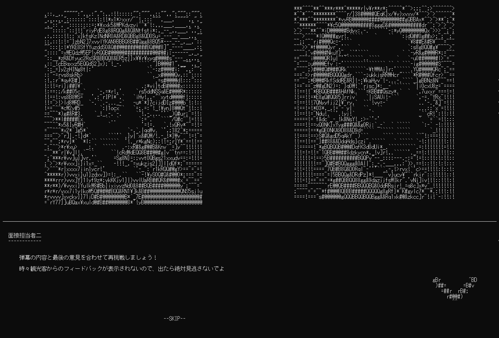
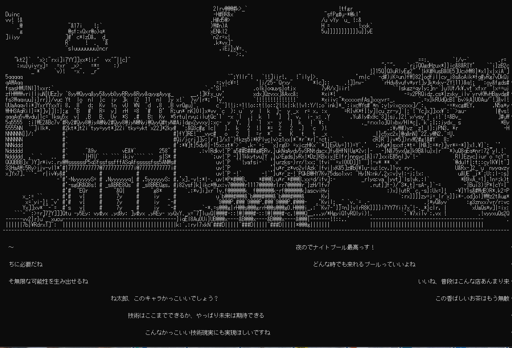
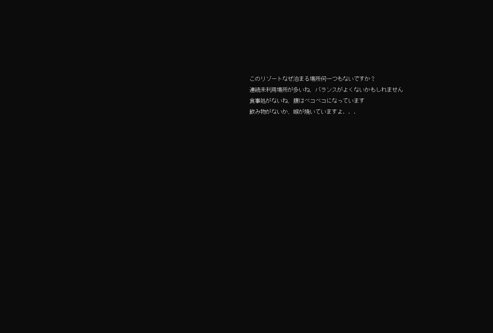
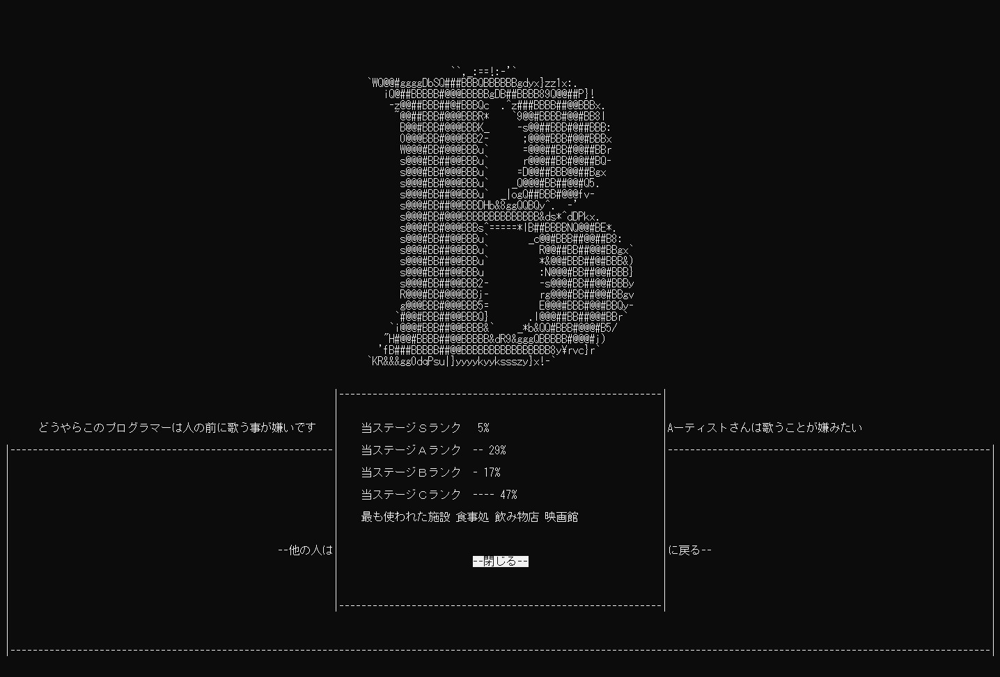
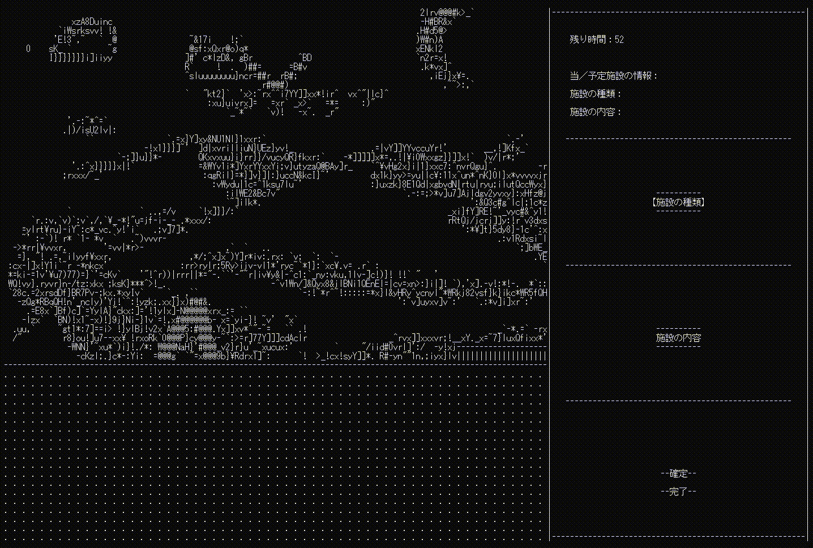
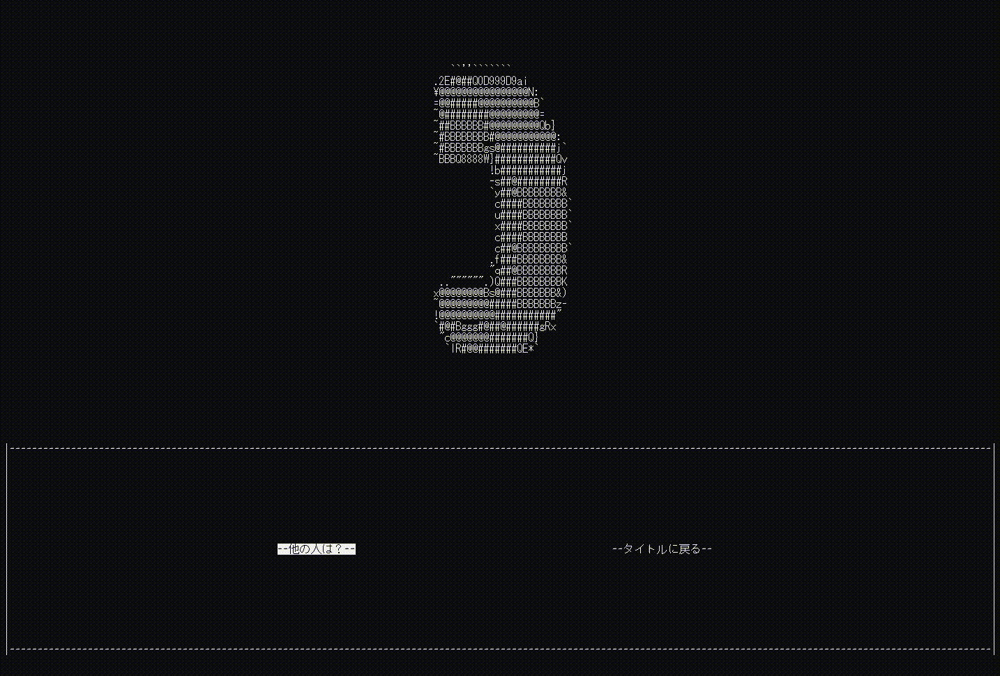

## 幻想リゾーターについて

>リゾーター（resorter）は造語、リゾートを作り出す人のことです

お客様の好みを発覚しつつ、満足度より高いリゾートを作るというキャラクターベースのゲームです。

これは、自作キャラクターベースゲーム開発フレームワーク[CLIG](https://github.com/HIBICUS-CAI/CLIG)により作った、2021HAL東京進級コンテスト（HEW）で銅賞受賞したゲームです。

**リンク**

- CLIGソースコード

- ソースコード

- [バイナリファイル](https://github.com/HIBICUS-CAI/HEW_GAME/releases/tag/v1.1.2)

## ゲームPV

<iframe width="100%" height="500" src="https://www.youtube.com/embed/_W7PwgBUOoA" title="YouTube video player" frameborder="0" allow="accelerometer; autoplay; clipboard-write; encrypted-media; gyroscope; picture-in-picture" allowfullscreen></iframe>

## ゲームシステム

プレーヤーの目的は、それぞれ種類のお客のお好みを発見しつつ、挑戦を繰り返して、より高いランクを取得し、お客たち皆楽しめるリゾートを作ることです。

ラウンド開始＆終了の時、”謎のNPC”からヒントを受け取る可能性があります。

また、各施設に対する感想発表は来客が遊ぶとき生放送のような弾幕の形で表示され、

当ラウンドのランク発表する前、全体的な改善意見も表示されます。

さらに、オンライン機能をオンにしたら、他のプレーヤーに選択された人気選択肢も参考になります。

以上の手段でお客の好みへの理解を深くにし、最高ランクを取得する時達成感を味わうことは、このゲームのコンセプトです。

## アピールしたいところ

- 色ではなくキャラクタによりの画面表示

    色での表示も表現力あるですが、ピクセルとしてコンソールでの四角の大きさが結構大きくて、それをより豊かな細部でも表示させたいので、ASCIIキャラクタで表示するという方法を思いつきました。

    移動速度により作った遠近感、かつ背景と人物がほぼ全部アニメーション付きなので、例え同じ色でも分かりやすいし、描画スタイルとしても特別感が感じられます。

    

    

- 搭載したネット機能

    [MariaDB](https://mariadb.com/)を利用してランクと選択肢集計用の遠隔データベースを作り、ペルソナ５の「この一日他のプレーヤーが取った行動ランキング」と似ていて、プレーヤーに参考になれる情報を提供しています。

    

    クラウドサーバーにデータベースを構築し、ゲームのクライアントに特定の権限を与えるという形で動作しています（オフできます）。毎回リザルトが出たら、今回配置された施設の情報と最終リザルトをデータベースにアップロードして更新処理を行う、そして参考したいときはそれらの情報をサーバーから取得して、閲覧を行います。

- 高い完成度

    自分で作ったゲームの中で、完成度、ボリュームが一番高いという自信があります。

    全てのお客種類にそれぞれの施設との相性を考慮し、口調を想像して好きか嫌いかの可能なフィードバックも全部熟慮しました。（例えば子供連れの家族は酒を避けたいとか、砂漠の中に飲み物店があれば好評とか）

    また、プレーヤーの選択により全体的な改善点（空き地のバランスが悪い、喉が渇いたのに飲み物店ないとか）を検出こともできます。

    さらに、これらの情報をそのままプレーヤーに渡すではなく、ちゃんとお客のロールに合わせた口調で、プレーヤー自身の思考を刺激できる言葉に精一杯調整していました。

## 他の情報

- 開発期間：元フレームワークの調整約一週間、ゲーム開発約一ヶ月
- 開発ツール：CLIG、Visual Studio、Git