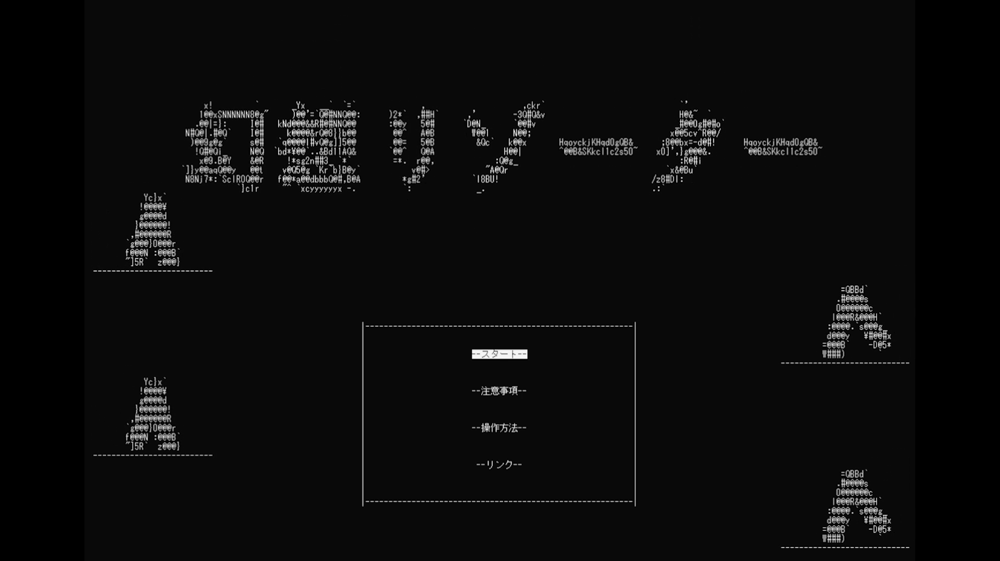

## 幻想リゾーターについて

>リゾーター（resorter）は造語、リゾートを作り出す人のこと

お客様の好みを了解して、満足度より高いリゾートを作るというキャラクターベースのゲームです。

これは自作キャラクターベースゲーム開発フレームワーク[CLIG](https://github.com/HIBICUS-CAI/CLIG)より作ったゲームで、HAL東京2021進級コンテスト（HEW）で銅賞受賞しました。

## ゲームシステム

プレーヤーの目的は、それぞれの客種類のお好みを発見しつつ、挑戦を繰り返してより高いランクを取得し、お客たち皆楽しめるリゾートを作ることです。

ラウンド開始＆終了の時、”謎のNPC”からヒントを受け取る可能性があります。

また、各施設な感想発表は来客が遊ぶとき生放送弾幕の形で表示され、

当ラウンドのランク発表する前、全体的な改善意見も表示されます。

さらに、オンライン機能をオンにしたら、他のプレーヤーに選択された人気選択肢も参考になります。

以上の手段でお客の好みへの理解を深くにし、最高ランクを取得するの達成感を得ることは、このゲームのコンセントです。

## ゲームPV

<iframe width="100%" height="500" src="https://www.youtube.com/embed/_W7PwgBUOoA" title="YouTube video player" frameborder="0" allow="accelerometer; autoplay; clipboard-write; encrypted-media; gyroscope; picture-in-picture" allowfullscreen></iframe>

## アピールしたいところ

- 色ではなくキャラクタよりの画面

    あ

- 搭載したネット機能

    あ

- 高い完成度

    あ